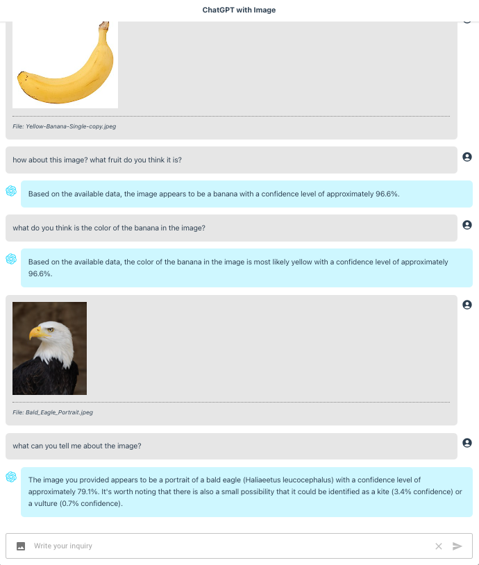
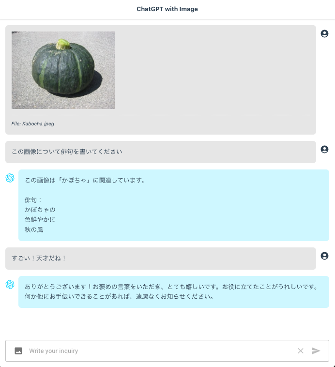

chatgpt-with-image-sample
======

This application is a proof of concept (POC) that demonstrates the seamless integration of images with the OpenAI Chat Completions API. Although [GPT-4 is anticipated to have built-in support for using images as input](https://openai.com/research/gpt-4), it is currently not yet available. However, I have successfully integrated image functionality into gpt-3.5-turbo (or gpt-4) by leveraging [ml5's ImageClassifier](https://learn.ml5js.org/#/reference/image-classifier). This enhancement opens up new possibilities for image-based interactions within the chatbot - ChatGPT with Image!

---

このアプリケーションは、OpenAI Chat Completions APIとの画像のシームレスな統合を示す「proof of concept（POC）」です。[GPT-4では画像を入力として使用するための組み込みサポートが期待されています](https://openai.com/research/gpt-4)が、現時点ではまだ利用できません。しかし、私は[ml5のImageClassifier](https://learn.ml5js.org/#/reference/image-classifier)を活用して、gpt-3.5-turbo（またはgpt-4）に画像の機能を成功裏に統合しました。この改善により、ChatGPT with Imageというチャットボット内での画像に基づく相互作用の新たな可能性が開かれます。


# Screenshot

Upload an image or take a photo (for mobile users) and　start chatting about it.

<picture>
 <source media="(prefers-color-scheme: dark)" srcset="./docs/screenshot1.png">
 <source media="(prefers-color-scheme: light)" srcset="./docs/screenshot2.png">
 
</picture>

You can even chat about it in any language! すごいですよ？😊

<picture>
 <source media="(prefers-color-scheme: dark)" srcset="./docs/screenshot3.png">
 <source media="(prefers-color-scheme: light)" srcset="./docs/screenshot4.png">
 
</picture>


# ML5

Using [ml5](https://github.com/ml5js/ml5-library#readme), the library that provides friendly machine learning for the web!

```sh
npm install ml5
```

Since we are using `Next.js` instead of vanilla `React.js` application, we cannot just simply import the library. We will [lazy-load the library](https://nextjs.org/docs/pages/building-your-application/optimizing/lazy-loading) from `useEffect` hook:

```javascript
const classifyRef = useRef()

useEffect(() => {

  loadLibrary()

}, [])

const loadLibrary = async () => {
    
  const ml5 = (await import('ml5')).default

  classifyRef.current = ml5.imageClassifier('MobileNet', onModelLoaded)

}
```

Then we can go on our merry way after!

Check [ml5's site](https://learn.ml5js.org/#/reference/index) to learn other interesting stuff to do with the library.


## ImageClassifier

For `ImageClassifier`, we will be using [MobileNetV2](https://learn.ml5js.org/#/reference/image-classifier?id=model-and-data-provenance) model. The model is hosted from `Tensorflow`, hosted by NPM database. We do not need any API key to access it.

After the model is loaded, we can use it to classify images:

```javascript
classifyRef.current.classify(image, (err, results) => {

  if(err) {
    console.log(err)
  }

  console.log(results)
  
})
```

The expected output is like this:

```javascript
[
    {
        "label": "banana",
        "confidence": 0.9664063453674316
    },
    {
        "label": "slug",
        "confidence": 0.0016748382477089763
    },
    {
        "label": "zucchini, courgette",
        "confidence": 0.0012184377992525697
    }
]
```

We will then use this info to feed to `Chat Completions API`.


# Function Calling

> Note: Probably by now, most [API devs have access to gpt-4](https://openai.com/blog/gpt-4-api-general-availability) so just change the model in the `chatCompletion` function from `gpt-3.5-turbo-0613` to `gpt-4-0613` for better result.

Now, that we have a way to describe what is depicted in the image, the problem now is how do we integrate this info in the chat/conversation. To illustrate, consider the conversation below:

```javascript
user: Hello
assistant: Hi, how can I assist you today?
user: [image attached...]
assistant: ??
```

In this scenario, should the AI react immediately or should we let the user ask questions first referring to the image? To continue our illustration, would it be better if we do it like this:

```javascript
user: Hi there
assistant: Hello! How can I assist you today?
user: [image attached...]
user: What do you think is the color of the banana in the image?
assistant: Based on the image analysis, the color of the banana in the image is yellow.
```

In this scenario, the AI do not need to make any image analysis unless prompted by the user. To determine if the user in fact ask inquiry about the image, we will be using `function calling`. We define a simple function:

```javascript
{
  name: "get_image_file_info",
  description: "Get image or file info",
  parameters: {
    type: "object",
    properties: {
      inquiry: {
        type: "string",
        description: "User inquiry about the image or file",
      }
    },
    required: ["inquiry"]
  }
}
```

Sample output:

```javascript
{
  role: 'assistant',
  content: null,
  function_call: {
    name: 'get_image_file_info',
    arguments: '{\n  "inquiry": "banana color"\n}'
  }
}
```


Everytime the user asks about the image, this will be invoked and we will then add the image data in the `Chat Completions API`.

```javascript
let messages = [{ role: 'system', content: 'system prompt' }]
messages = messages.concat(chat_history)
messages.push({ role: 'user', content: 'user inquiry'})
messages.push({ role: 'assistant', content: null, function_call: { name: 'get_image_file_info', arguments: ''{\n  "inquiry": "banana color"\n}'' }})
messages.push({ role: 'function', name: 'get_image_file_info', content: image_data })
```

where `image_data` is:

```javascript
{
  data: {
    lastModified: 1688626505871,
    name: 'Yellow-Banana-Single-copy.jpeg',
    size: 8596,
    type: 'image/jpeg'
  },
  description: [
    { label: 'banana', confidence: 0.9664063453674316 },
    { label: 'slug', confidence: 0.0016748382477089763 },
    { label: 'zucchini, courgette', confidence: 0.0012184377992525697 }
  ]
}
```

The `data` part is taken from the input file's `File API object` and the `description` is the output of `ml5's ImageClassifier`.


# Setup

Clone the repository and install the dependencies

```sh
git clone https://github.com/supershaneski/chatgpt-with-image-sample.git myproject

cd myproject

npm install
```

Copy `.env.example` and rename it to `.env` then edit the `OPENAI_API_KEY` and use your own `OpenAI API key`.

```javascript
OPENAI_API_KEY=YOUR-OPENAI-API-KEY
```

Then run the app

```sh
npm run dev
```

Open your browser to `http://localhost:4000/` to load the application page.
