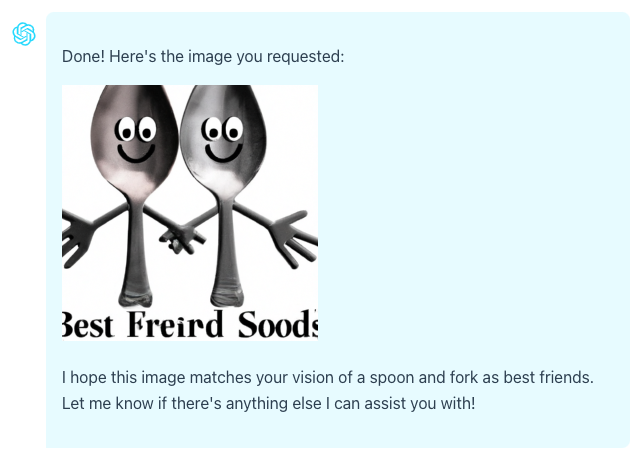

chatgpt-with-image-sample
=====

This sample project integrates OpenAI's [GPT-4 Vision](https://openai.com/blog/chatgpt-can-now-see-hear-and-speak), with advanced image recognition capabilities, and [DALL·E 3](https://openai.com/dall-e-3), the state-of-the-art image generation model, with the [Chat completions API](https://platform.openai.com/docs/guides/gpt/chat-completions-api). This powerful combination allows for simultaneous image creation and analysis.

---

このサンプルプロジェクトは、高度な画像認識機能を持つOpenAIの[GPT-4 Vision](https://openai.com/blog/chatgpt-can-now-see-hear-and-speak)と、最先端の画像生成モデルである[DALL·E 3](https://openai.com/dall-e-3)、そして[Chat completions API](https://platform.openai.com/docs/guides/gpt/chat-completions-api)を統合しています。この強力な組み合わせにより、画像の作成と分析を同時に行うことが可能になります。


# Motivation

I started this project with the aim of using image analysis with GPT-4. However, at that time, image input was not yet available. In lieu of image input in Chat API, I used [ml5's ImageClassifier](#ml5-image-classifier) instead, which proved to be quite effective for basic object analysis. In my opinion, if your goal is just to create an application like a ***Bring Me*** or ***Scavenger Hunt*** type of game app, it should suffice.

My interest was reignited when OpenAI [announced the addition of new features to ChatGPT, including voice and vision capabilities](https://openai.com/blog/chatgpt-can-now-see-hear-and-speak). Nevertheless, there was no specific mention of APIs, although rumors suggested that everything would be unveiled during OpenAI [DevDay](https://devday.openai.com/).

Consequently, I decided to revisit this project, picking up where I had left off. In the absence of any documentation for the API, I had to make educated guesses about how image input would be implemented, including the request parameters and response format. I also drew insights from those who had gained access to ChatGPT with image input functionality.


# DALL·E 3

Since OpenAI added [DALL·E 3 image creation in ChatGPT](https://openai.com/blog/dall-e-3-is-now-available-in-chatgpt-plus-and-enterprise), users soon realized that it would have been better if they can use DALL·E 3 and Image Analysis at the same chat session. But the way it is currently implemented in ChatGPT, it seem not possible unless you download and upload the images back and forth from different sessions.

So for this project, I added DALL·E image creation ＼(^o^)／! However, as I am updating this project, DALL·E 3 API is not yet available so I am using DALL·E 2 ***with great expectations for DALL·E 3***! 😂

Since DALL·E is a separate API, I will be using ***function calling*** to trigger image creation.

```javascript
{
    "name": "create_image_dall-e",
    "description": "Create images in DALL-E based on prompts provided",
    "parameters": {
        "type": "object",
        "properties": {
            "items": {
                "type": "array",
                "description": "List of prompts that the user selected",
                "items": {
                    "type": "object",
                    "properties": {
                        "prompt": {
                            "type": "string",
                            "description": "The prompt based from user input"
                        },
                        "size": {
                            "type": "string",
                            "description": "The size of the image, use the default if the user does not provide any",
                            "default": "256x256",
                            "enum": [
                                "256x256",
                                "512x512",
                                "1024x1024"
                            ]
                        },
                        "image_count": {
                            "type": "integer",
                            "description": "The number of images to generate, between 1 and 10",
                            "default": 0
                        }
                    },
                    "required": ["prompt", "size", "image_count"]
                }
            }
        },
        "required": ["items"]
    }
}
```

As you may have noticed, this will allow to create images from several prompts. 
Furthermore, it also allow for the creation of several variations for each prompt.
Theoretically, there is no restriction to how many images that can be created using this function.
As for the prompts, in ChatGPT, each image has different prompt. I am thinking if I should do the same and just remove `image_count`.

I also added instructions to control image creation in the `system prompt` including restricting the AI in prompt creation. I want the user to have the foremost authorship.

```javascript
`When the user wants to create an image, it means they want to create an image using DALL-E and you will help them to write the prompt for DALL-E.\n` +
`When creating prompt for image creation, do not make up your own prompt.\n` +
`Ask the user their own ideas of what image they want to be.\n` +
`If the description is vague, clarify to the user some elements to make it clearer.` +
`Confirm to the user the image prompt before calling create_image_dall-e.\n` +
`If possible, give them several variations of possible prompts.\n` +
```

Here is a sample output

```javascript
{
  role: 'assistant',
  content: null,
  function_call: {
    name: 'create_image_dall-e',
    arguments: '{\n' +
      '  "prompt": "Create a cartoon image of a spoon and fork personified as best friends, standing together with their arms around each other and wearing big smiles.",\n' +
      '  "size": "512x512",\n' +
      '  "image_count": 1\n' +
      '}'
  }
}
```

We will then call the DALL·E API

```javascript
const image = await openai.images.generate({
  prompt: "Create a cartoon image of a spoon and fork personified as best friends, standing together with their arms around each other and wearing big smiles.",
  size: "512x512",
  image_count: 1
})
```

After getting the results from DALL·E API, I will save the generated images to the server to make it available for image analysis later, if needed.

Then I send everything back to the Chat completions API for summary. I do this to insert the image result in the conversation history. You will then receive a similar result from below:

```javascript
{
  role: 'assistant',
  content: "Done! Here's the image you requested:\n" +
    '\n' +
    '\n' +
    '\n' +
    "I hope this image matches your vision of a spoon and fork as best friends. Let me know if there's anything else I can assist you with!"
}
```

At first, I tried to use [react-markdown](https://github.com/remarkjs/react-markdown#readme) to display the content directly but I cannot control how the images are shown specially if there are more than one images. The module allows for the use of [plugin](https://github.com/remarkjs/react-markdown#use-a-plugin) but I do not have time to look into it. So, for now, I just made my own quick and dirty text formatting to show the text and output images.

<picture>
 <source media="(prefers-color-scheme: dark)" srcset="./docs/dall-e-1.png">
 <source media="(prefers-color-scheme: light)" srcset="./docs/dall-e-2.png">
 
</picture>

If `stream` were set to true in Chat completions API, we could display a waiting message to the user before the DALL·E API is called, thereby enhancing the user experience. However, at present, I’m not familiar with how to implement streaming in Next.js. 


# GPT-4 Vision

From what I can gather, image input is included in API call together with the other chat parameters.
In the app, there are two ways to perform image analysis. First, you can send the image data together with your query. The number of images you can upload at one time is controlled by the variable `maxFileUploadCount` in the `next.config.js` file. I was assuming that gpt-4-vision will let multiple image input per call based on the behavior from ChatGPT but I am not sure, and if possible, what is the upper limit.

```javascript
env: {
    ...
    maxFileUploadCount: 10,
},
```

The second way to perform image analysis is by referring the image data from the context. For this case, I am using function calling to get the image data.

```javascript
{
    "name": "get_image_for_analysis",
    "description": "Get image data referenced by the user from conversation history",
    "parameters": {
        "type": "object",
        "properties": {
            "images": {
                "type": "array",
                "description": "An array of the image data referenced by the user, in URL form",
                "items": {
                    "type": "string",
                    "description": "Image data represented by a relative URL"
                }
            },
            "query": {
                "type": "string",
                "description": "Query of the user"
            }
        },
        "required": ["images", "query"]
    }
}
```

This will tell me which image the query is referring. 

<picture>
 <source media="(prefers-color-scheme: dark)" srcset="./docs/upload1.png">
 <source media="(prefers-color-scheme: light)" srcset="./docs/upload2.png">
 
</picture>


# ML5 Image Classifier

Before updating the app to incorporate `gpt-4-vision` for image analysis, I was using [ml5's ImageClassifier](https://learn.ml5js.org/#/reference/image-classifier).

To use it, you must first load the model. Here, I'm using `MobileNet`.
```javascript
const classifier = ml5.imageClassifier('MobileNet', modelLoaded);

function modelLoaded() {
  console.log('Model Loaded!');
}
```

There are other models available depending on your specific needs, such as `Darknet` and `DoodleNet`. Alternatively, you can load the model from a local directory. Please refer to the [usage section](https://learn.ml5js.org/#/reference/image-classifier?id=usage) for more information.

Once the model is loaded, you can use it to your heart's content since it's free!
```javascript
classifier.classify(document.getElementById('image'), (err, results) => {
  console.log(results);
});
```

Here's an example of a typical output
```javascript
const image_result = [
    {
        "label": "banana",
        "confidence": 0.9664063453674316
    },
    {
        "label": "slug",
        "confidence": 0.0016748382477089763
    },
    {
        "label": "zucchini, courgette",
        "confidence": 0.0012184377992525697
    }
]
```

To integrate this with OpenAI's Chat Completion API, you can either append this to the system prompt or use function calling and insert it as a result of the function.
```javascript
message.push({ role: 'assistant', content: null, function_call: { name: 'analyse_image', arguments: '{\n  "inquiry": "fruit"\n}'}})
message.push({ role: 'function', name: 'analyse_image', content: JSON.stringify({ result: image_result }) })
```

Occasionally, it produces unexpected results, which can add an element of surprise and make a game app more engaging.


# Setup

Clone the repository and install the dependencies

```sh
git clone https://github.com/supershaneski/chatgpt-with-image-sample.git myproject

cd myproject

npm install
```

Copy `.env.example` and rename it to `.env` then edit the `OPENAI_API_KEY` and use your own `OpenAI API key`.

```javascript
OPENAI_API_KEY=YOUR-OPENAI-API-KEY
```

Then run the app

```sh
npm run dev
```

Open your browser to `http://localhost:4000/` to load the application page.
