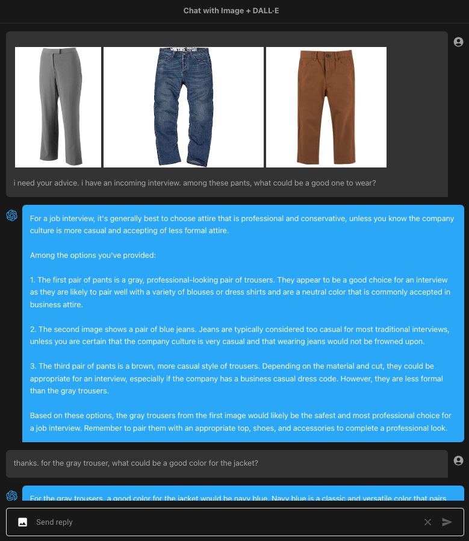
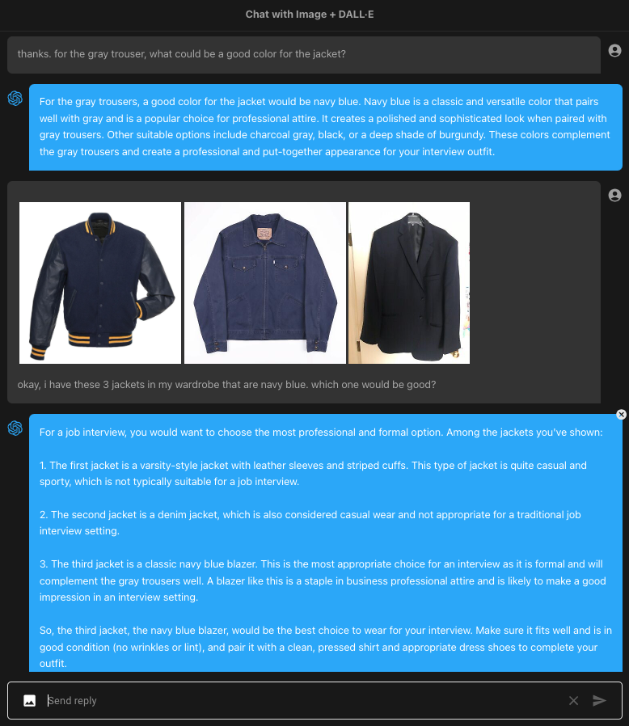
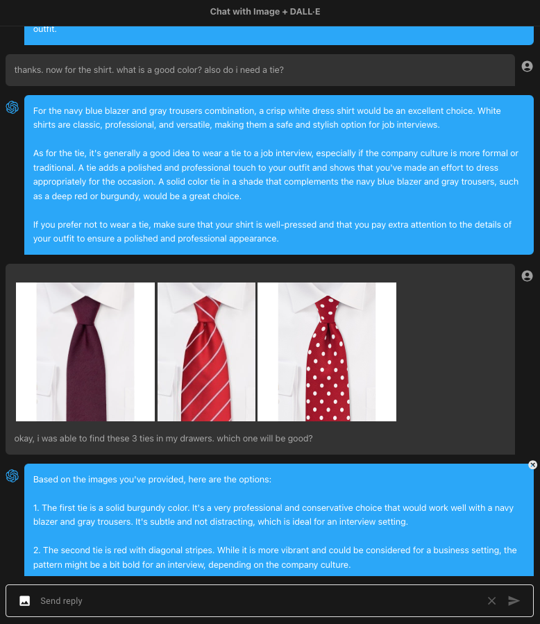
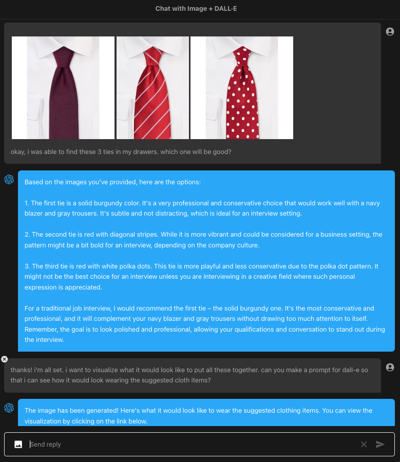
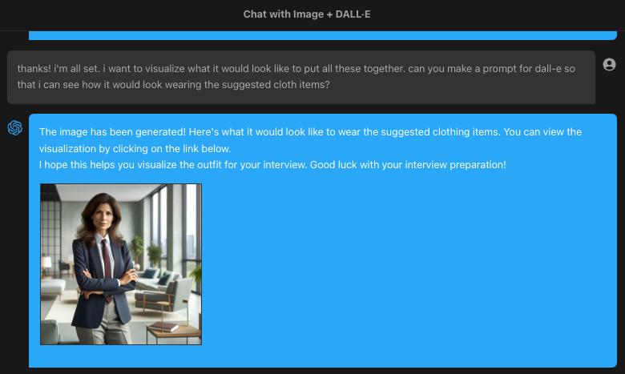
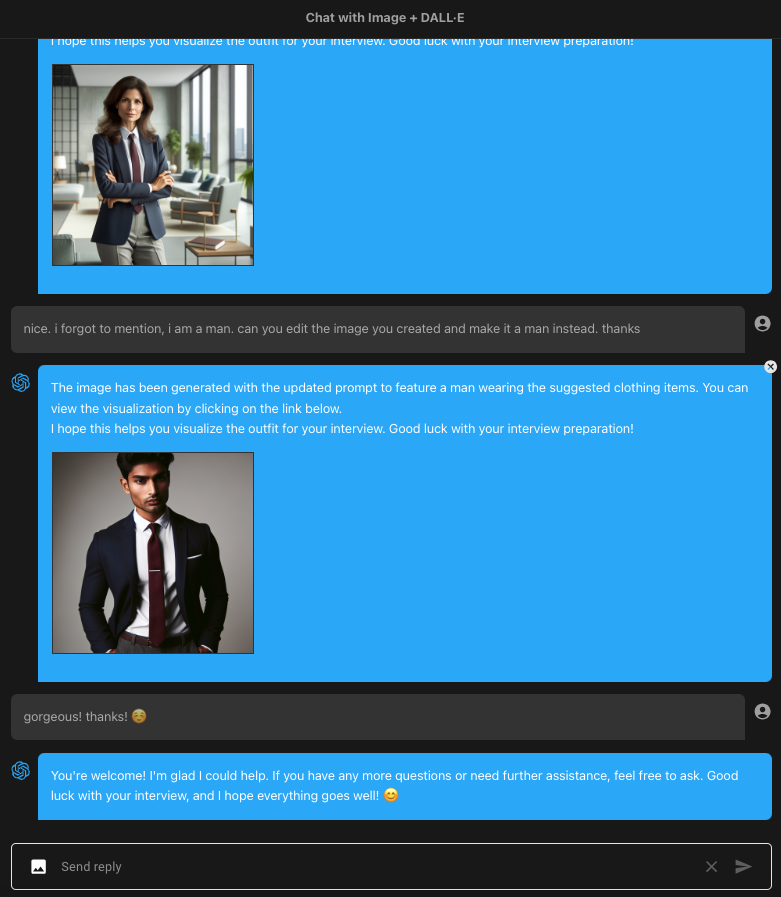

chatgpt-with-image-sample
=====

v0.0.2

This sample project integrates OpenAI's [GPT-4 Vision](https://openai.com/blog/chatgpt-can-now-see-hear-and-speak), with advanced image recognition capabilities, and [DALL·E 3](https://openai.com/dall-e-3), the state-of-the-art image generation model, with the [Chat completions API](https://platform.openai.com/docs/guides/gpt/chat-completions-api). This powerful combination allows for simultaneous image creation and analysis.

---

このサンプルプロジェクトは、高度な画像認識機能を持つOpenAIの[GPT-4 Vision](https://openai.com/blog/chatgpt-can-now-see-hear-and-speak)と、最先端の画像生成モデルである[DALL·E 3](https://openai.com/dall-e-3)、そして[Chat completions API](https://platform.openai.com/docs/guides/gpt/chat-completions-api)を統合しています。この強力な組み合わせにより、画像の作成と分析を同時に行うことが可能になります。


**Updated**: Using [v4.19.1 OpenAI Node module](https://www.npmjs.com/package/openai)

# Motivation

I started this project with the aim of using image analysis with GPT-4. However, at that time, image input was not yet available. In lieu of image input in Chat API, I initially used [ml5's ImageClassifier](#ml5-image-classifier) instead, which proved to be quite effective for basic object analysis. In my opinion, if your goal is just to create an application like a ***Bring Me*** or ***Scavenger Hunt*** type of game app, it should probably suffice.

Since the new APIs were released recently, following OpenAI DevDay, I have updated this sample project to utilize the latest APIs and models.


# DALL·E 3

For [DALL·E 3 image creation](https://platform.openai.com/docs/guides/images/introduction?context=node), we will need to trigger the function call `create_image_dall-e`.

```javascript
{
    "name": "create_image_dall-e",
    "description": "Create images in DALL-E 3 based on prompts provided",
    "parameters": {
        "type": "object",
        "properties": {
            "items": {
                "type": "array",
                "description": "List of prompts that the user selected",
                "items": {
                    "type": "object",
                    "properties": {
                        "prompt": {
                            "type": "string",
                            "description": "The prompt based from user input"
                        },
                        "size": {
                            "type": "string",
                            "description": "The size of the image, use the default if the user does not provide any",
                            "default": "1024x1024",
                            "enum": [
                                "1024x1024",
                                "1024x1792",
                                "1792x1024"
                            ]
                        },
                        "quality": {
                            "type": "string",
                            "description": "The quality of the image",
                            "default": "standard",
                            "enum": [
                                "standard",
                                "hd"
                            ]
                        }
                    },
                    "required": ["prompt", "size", "quality"]
                }
            }
        },
        "required": ["items"]
    }
}
```

Here is the sample output

```javascript
{
  items: [
    {
      prompt: 'Generate an album cover for the ska band Tsokolate, conveying a cool ska aesthetic. The background is white. Inside a vintage muscle car colored in aquamarine, three band members are dressed in chic suits. Two members are seated in the front, and the driver is wearing shades. One member is sitting in the back. The image size is 1024x1792 and the quality is standard.',
      size: '1024x1792',
      quality: 'standard'
    }
  ]
}
```

If you want to generate multiple images, you can ask the AI to generate several prompts and tell it to proceed to create image based on all the prompts. We can handle it in one API call since we are using array in our function.

```javascript
let image_result = await Promise.all(
    Array.from(image_items).map(async (img) => {

        const image_prompt = img.prompt
        const image_size = img.size
        const image_quality = img.quality
        
        try {

            const dalle_image = await openai.images.generate({ 
                model: 'dall-e-3',
                prompt: image_prompt,
                quality: image_quality,
                size: image_size
            })

            return {
                prompt: image_prompt,
                url: dalle_image.data[0].url
            }

        } catch(error) {

            console.log(error.name, error.message)
            
            return null

        }

    })
)
```

After receiveing the generated image urls from the API, we will then save a copy in our [/public/uploads](/public/uploads/) directory.

```javascript
let image_list = await Promise.all(
    Array.from(image_result).map(async (img) => {
        
        const filename = `tmp-${Date.now()}`
        let filepath = path.join('public', 'uploads', filename)

        const data_response = await fetch(img.url)

        try {

            await streamPipeline(data_response.body, fs.createWriteStream(filepath))

            return {
                url: `/uploads/${filename}`,
                alt: `${img.prompt}`
            }

        } catch(error) {

            console.log(name, error)

            return null

        }

    })
)
```

Now, when we submit the result back to **Chat Completions API**, we will not be including this data.
We will just send the status and message. We will directly send the image data as part of the response back to the client and let the client deal with it.


# GPT-4 Vision

For image analysis, we will be using the new [GPT-4 with Vision](https://platform.openai.com/docs/guides/vision), currently still in ***preview mode*** which means we only got **100 RPD**!

In the app, there are two ways to send image for analysis: send image with query and refer to any image in the conversation.

Currently, you can send as many as 10 images when you send your query. You can edit the number from `next.config.js` file:

```javascript
env: {
    ...
    maxFileUploadCount: 10,
},
```

When you refer to an image in the conversation for image analysis, function calling will be triggered:

```javascript
{
    "name": "get_image_for_analysis",
    "description": "Get image data referenced by the user from conversation history",
    "parameters": {
        "type": "object",
        "properties": {
            "images": {
                "type": "array",
                "description": "An array of the image data referenced by the user, in URL form",
                "items": {
                    "type": "string",
                    "description": "Image data represented by a relative URL"
                }
            },
            "query": {
                "type": "string",
                "description": "Query of the user"
            }
        },
        "required": ["images", "query"]
    }
}
```

Here is the sample output

```javascript
{
  images: [ '/uploads/tmp170061562847486897_yasai.jpeg' ],
  query: 'Identify long green vegetable'
}
```

The GPT-4V supports image input either via URL or Base64 image. If URL, we will need it hosted somewhere with https. But we are using relative paths!
No problemo. We have all the image files saved in the `/public/uploads` directory.

When you send image with the query, we first upload the image and only send the relative url and base64 data with the query.

When you refer to an image from the conversation, we use the relative path to get to the image file and encode it to base64.

So, we are always sending base64 image data!

# Sample Conversation

Here is a sample conversation using image analysis and creation.



I uploaded 3 images of different pants and laid out a scenario and ask for fashion recommendation. So this will go straight to GPT-4V.

I then ask follow up question for color of jacket, it tells me the appropriate color. Based on this, I uploaded 3 jackets of that color and ask for suggestion.



Again, this will go straight to GPT-4V for analysis.

I ask for what color of the tie will be good for gray pants and navy blue jacket. It gave me two suggestions: deep red and burgundy. So, I again scoured the web for such ties, uploaded it and ask it which one will be good.





Okay, now we are all set. The wardrobe is complete. So I ask it to create the image of what I may look like wearing its fashion recommendation.

Under the hood, the function calling is triggered

```javascript
{
  items: [
    {
      prompt: 'A person wearing a navy blue blazer, gray trousers, a white dress shirt, and a solid burgundy tie. The person is standing in a professional setting.',
      size: '1024x1024',
      quality: 'standard'
    }
  ]
}
```

Here is the output

```javascript
{
  status: 'image generated',
  message: "Done! Here's the image you requested...",
  images: [
  {
    url: '/uploads/tmp-1700628156120-img-JjENGYQcLJ0q7E98XeRlUuQO.png',
    alt: 'A person wearing a navy blue blazer, gray trousers, a white dress shirt, and a solid burgundy tie. The person is standing in a professional setting.'
  }
]
}
```



Nice! But we ask it to make it a man instead. Again, function calling is triggered.

```javascript
{
  items: [
    {
      prompt: 'A man wearing a navy blue blazer, gray trousers, a white dress shirt, and a solid burgundy tie.',
      size: '1024x1024',
      quality: 'standard'
    }
  ]
}
```

And here is the output

```javascript
{
  status: 'image generated',
  message: "Done! Here's the image you requested...",
  images: [
  {
    url: '/uploads/tmp-1700628230966-img-UMM4IXgWgonDQyyYTCMRY9H8.png',
    alt: 'A man wearing a navy blue blazer, gray trousers, a white dress shirt, and a solid burgundy tie.'
  }
]
}
```




# ML5 Image Classifier

Before updating the app to incorporate `gpt-4-vision` for image analysis, I was using [ml5's ImageClassifier](https://learn.ml5js.org/#/reference/image-classifier).

To use it, you must first load the model. Here, I'm using `MobileNet`.
```javascript
const classifier = ml5.imageClassifier('MobileNet', modelLoaded);

function modelLoaded() {
  console.log('Model Loaded!');
}
```

There are other models available depending on your specific needs, such as `Darknet` and `DoodleNet`. Alternatively, you can load the model from a local directory. Please refer to the [usage section](https://learn.ml5js.org/#/reference/image-classifier?id=usage) for more information.

Once the model is loaded, you can use it to your heart's content since it's free!
```javascript
classifier.classify(document.getElementById('image'), (err, results) => {
  console.log(results);
});
```

Here's an example of a typical output
```javascript
const image_result = [
    {
        "label": "banana",
        "confidence": 0.9664063453674316
    },
    {
        "label": "slug",
        "confidence": 0.0016748382477089763
    },
    {
        "label": "zucchini, courgette",
        "confidence": 0.0012184377992525697
    }
]
```

To integrate this with OpenAI's Chat Completion API, you can either append this to the system prompt or use function calling and insert it as a result of the function.
```javascript
message.push({ role: 'assistant', content: null, function_call: { name: 'analyse_image', arguments: '{\n  "inquiry": "fruit"\n}'}})
message.push({ role: 'function', name: 'analyse_image', content: JSON.stringify({ result: image_result }) })
```

Occasionally, it produces unexpected results, which can add an element of surprise and make a game app more engaging.


# Setup

Clone the repository and install the dependencies

```sh
git clone https://github.com/supershaneski/chatgpt-with-image-sample.git myproject

cd myproject

npm install
```

Copy `.env.example` and rename it to `.env` then edit the `OPENAI_API_KEY` and use your own `OpenAI API key`.

```javascript
OPENAI_API_KEY=YOUR-OPENAI-API-KEY
```

Then run the app

```sh
npm run dev
```

Open your browser to `http://localhost:4000/` to load the application page.
